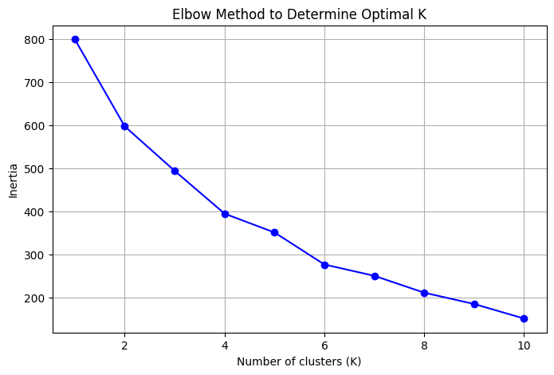
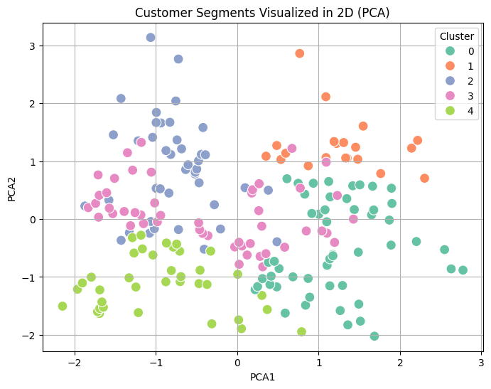

# ElevateLabs Internship
## 🧠 Task 8: Clustering with K-Means

### 🎯 Objective
Segment mall customers into distinct groups using the **K-Means clustering algorithm**, and evaluate clustering quality using appropriate metrics.

---

### 📌 Dataset Overview
We used the `Mall_Customers.csv` dataset which includes customer details like:
- Age  
- Annual Income  
- Spending Score

These attributes help us understand and segment customer behavior.

---

### 📊 Elbow Method to Determine Optimal K

To determine the optimal number of clusters, we applied the **Elbow Method**, which plots the inertia (within-cluster sum of squares) for values of `K` from 1 to 10.

📍 **Observation**:  
The "elbow" in the plot appears at **K = 5**, suggesting 5 is the optimal number of clusters.

---

### 🌀 K-Means Clustering & PCA Visualization

After clustering the dataset with **K = 5**, we applied **Principal Component Analysis (PCA)** to reduce the dimensions to 2D for visual interpretation.

📍 **Observation**:  
The PCA visualization shows five clusters, which are **reasonably well separated**. There is some **slight overlap**, but most clusters are distinct.

---

### 📈 Silhouette Score

To evaluate the clustering quality, we used the **Silhouette Score**.

- **Silhouette Score**: `0.272`

📍 **Interpretation**:  
This is a **moderate score**, indicating:
- Clusters are formed with some structure.
- However, **several points may be near cluster boundaries**, causing overlap.

---

### ✅ Key Insights & Conclusions

- The **optimal number of clusters is 5**, as suggested by the Elbow Method.
- **PCA visualization** supports that the clusters have meaningful separation.
- A **Silhouette Score of 0.272** indicates **moderate clustering performance** — enough to reveal patterns, but not highly compact or well-separated clusters.
- This analysis can help in:
  - **Customer segmentation** for marketing.
  - Understanding **spending behavior** and **income group targeting**.

---

### 💬 Common Interview Questions

1. **What is the Elbow Method and how do you interpret it?**  
   It helps choose the number of clusters by identifying the point after which inertia reduction slows.

2. **What is the Silhouette Score?**  
   A metric between -1 and 1 indicating how well a point fits within its assigned cluster vs others.

3. **Why use PCA after clustering?**  
   To visualize high-dimensional clusters in 2D or 3D.

4. **Why is choosing the correct K value important?**  
   Too few clusters may hide patterns; too many can overfit and lose generalization.

5. **What are limitations of K-Means?**  
   - Assumes spherical clusters  
   - Sensitive to outliers and initialization  
   - Requires predefined `K`

---

### 📦 Outcome

This clustering project demonstrates how unsupervised learning can uncover **hidden customer segments**, aiding in **data-driven marketing strategies** and **business decisions**.
